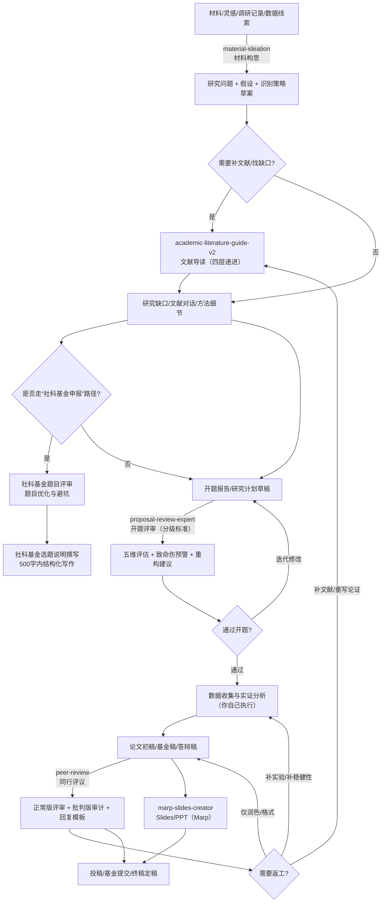

# 科研技能包合集（OpenClaw / LobsterAI / CoPaw）

本仓库提供 7 个围绕“做科研流程”的技能：材料构思 → 文献导读 →（社科基金题目评审/选题说明）→ 开题评审 → 同行评议（审稿与回复）→ Slides/PPT（Marp）。

[](https://opensource.org/licenses/MIT)
[](#)

---

## 🎯 技能清单

| 技能包                          |  版本 | 一句话说明                                                | 适用输入                       | 关键依赖/可选增强                      | 默认输出                     |
| ------------------------------- | ----: | --------------------------------------------------------- | ------------------------------ | -------------------------------------- | ---------------------------- |
| `academic-literature-guide-v2/` | 2.0.0 | PDF/URL → 四层递进式文献导读（直觉→概念→技术→批判）       | PDF、URL、DOI/标题             | 可选：检索验证（Web Search）           | `./文献导读/`                |
| `proposal-review-expert/`       | 1.0.0 | 开题报告分级评审（本科/硕士/博士）+ 致命伤预警 + 重构建议 | PDF、纯文本                    | 可选：RAG 验证（AnythingLLM 等）       | `./开题报告评审/`            |
| `peer-review/`                  | 2.0.0 | 同行评议/审稿意见回复：双轨评审（正常/批判）+ 原则 + 模板 | 论文全文、审稿意见、基金申请书 | 参考规范与模板（见 `templates.md` 等）   | 对话输出（可整理为审稿报告） |
| `社科基金题目评审/`             | 0.1.0 | 社科基金申报题目评审：规范性/创新性/可行性 + 一票否决项   | 题目文本（1–3 个备选更佳）     | 适配“基金申报”写作场景                  | 对话输出（含改写建议）       |
| `社科基金选题说明撰写指南/`     | 0.1.0 | 社科基金“选题说明”（500 字以内）结构化写作与范例          | 选题信息/要点/政策依据         | 适配“基金申报”写作场景                  | 对话输出（可直接粘贴）       |
| `material-ideation/`            |     — | 材料/文件夹 → 研究问题 + 假设 + 识别策略                  | 文件夹、PDF/Word/MD            | 依赖本地文件读取；可选 RAG             | `./研究构想/<材料名称>/`     |
| `marp-slides-creator/`          | 0.1.0 | Marp Slides/PPT 制作：内容消化→出稿→审阅→导出（HTML/PDF） | 论文/笔记/大纲/Markdown         | 需要 Node.js（用于 `npx @marp-team/marp-cli`） | `slides_<项目名>/05_final/` |

---

## 🧭 科研流程图（核心四技能 + 基金两技能 + Marp Slides）

下面按“做科研”的典型顺序，把 4 个核心技能串起来，并在“基金申报”分支加入 2 个写作技能（其中“数据收集/实证分析/写作排版”等环节通常由你自己完成或用其他工具完成）。



## ✅ 触发条件

下表来自各技能 `SKILL.md` 中的【触发场景 / 触发关键词】描述，用于你快速判断“该用哪个技能”。

| 技能                                       | 触发场景                                                                  | 触发关键词（示例）                                                                                                                     | 典型指令（示例）                                                                          |
| ------------------------------------------ | ------------------------------------------------------------------------- | -------------------------------------------------------------------------------------------------------------------------------------- | ----------------------------------------------------------------------------------------- |
| `academic-literature-guide-v2`（文献导读） | 上传 PDF；提供论文链接；请求解读文献；需要文献导读报告                    | 帮我读懂这篇、解读 PDF、生成导读、literature guide、explain this paper、一键导读、自动导读                                             | `帮我解读这篇 PDF：...` / `帮我解读这个链接的论文：...`                                   |
| `proposal-review-expert`（开题评审）       | 上传开题报告 PDF/文本；请求评审开题；开题评估；研究计划审核               | 开题评审、开题报告、评审这个开题、开题评估、proposal review、research proposal、开题答辩、评审 PDF                                     | `评审这份开题报告（硕士层次）...` / `评审这份开题，启用 RAG`                              |
| `peer-review`（同行评议）                  | 期刊审稿；基金评审；稿件修改；回复审稿意见（Response/Rebuttal）           | 同行评议、同行评审（核心触发）；审稿意见、response to reviewers、rebuttal、投稿、修改说明（常见表述）                                  | `请对这篇论文进行同行评议：...` / `帮我逐条回复以下审稿意见：...`                         |
| `社科基金题目评审`                         | 申报题目把关与改写：长度/概念数量/歧义/范围控制等硬性约束 + 四维评审       | 题目评审、评审题目、看看这个题目、申报题目、这个题目怎么样                                                                            | `帮我评审这 3 个社科基金题目：...`                                                        |
| `社科基金选题说明撰写指南`                 | 撰写“选题说明”（500字以内）：选题依据→具体问题→研究视角与方法（含政策引用） | 选题说明、选题依据、社科基金选题、课题论证                                                                                            | `按 500 字以内写一段选题说明：题目...要点...`                                              |
| `material-ideation`（材料构思）            | 用户提供具体材料（文件夹/文件路径），并请求基于材料提出研究问题/假设/识别 | 帮我看看这些材料能做什么研究、基于材料提出研究问题、有什么因果识别思路、从这些文献里提炼研究假设、读一下这个文件夹里的文件帮我构思研究 | `读一下这个文件夹里的文件，帮我构思研究：...` / `基于这些材料提出研究问题与识别策略：...` |
| `marp-slides-creator`（Marp Slides）       | 请求制作 slides / PPT / 演示文稿；希望把论文/大纲转换为可讲的幻灯片        | 制作slides、做PPT、演示文稿、Marp、幻灯片、presentation                                                                               | `把这篇论文做成 10 页 slides（主题 academic），并导出 PDF：...`                            |

### proposal vs 同行评议：怎么避免用错？

- **proposal-review-expert（开题评审）**：研究开始前的“计划阶段”评审，核心是“研究问题是否成立、设计是否可执行、层级标准（本科/硕士/博士）是否匹配”。  
  - 典型触发：开题/答辩/研究计划/Proposal/课题申请/硕士博士层级
- **peer-review（同行评议）**：研究完成后的“投稿/修改阶段”评审，核心是“证据是否充分、方法与统计是否严谨、写作与报告规范是否合规、审稿意见如何逐条回复”。  
  - 典型触发：审稿/审稿意见/Response/Rebuttal/投稿/修改说明/Manuscript
- **基金评审怎么选**：更像“委员会审稿/专家评审”（国自然/社科基金/基金申请书评估）→ `peer-review`；更像“学生开题/研究计划审核”→ `proposal-review-expert`

---

## 🚀 安装与验证

### 前置要求

- [OpenClaw / LobsterAI](https://github.com/openclaw/openclaw) 已安装并运行
- 如需 `proposal-review-expert` 启用 RAG：本地或远程可访问的 AnythingLLM（可选）

### 1) 安装 OpenClaw / LobsterAI 技能（4 个）

macOS / Linux：

```bash
cp -r academic-literature-guide-v2 material-ideation proposal-review-expert marp-slides-creator ~/Library/Application\ Support/LobsterAI/SKILLs/
```

Windows（PowerShell）：

```powershell
Copy-Item -Path "academic-literature-guide-v2","material-ideation","proposal-review-expert","marp-slides-creator" -Destination "$env:APPDATA\LobsterAI\SKILLs\" -Recurse
```

如果 LobsterAI 已在运行，重启一次以刷新技能列表。

### 2) 安装 CoPaw 技能（同行评议 + 社科基金写作）

`peer-review/` 为 CoPaw workspace 技能目录结构（与 OpenClaw/LobsterAI 的 `SKILLs/` 不同）。

macOS / Linux（默认工作目录 `~/.copaw/`）：

```bash
mkdir -p ~/.copaw/skills
cp -r peer-review 社科基金题目评审 社科基金选题说明撰写指南 ~/.copaw/skills/
```

Windows（PowerShell，默认工作目录 `%USERPROFILE%\.copaw\`）：

```powershell
New-Item -ItemType Directory -Force -Path "$env:USERPROFILE\.copaw\skills" | Out-Null
Copy-Item -Path "peer-review","社科基金题目评审","社科基金选题说明撰写指南" -Destination "$env:USERPROFILE\.copaw\skills\" -Recurse
```

### 3) 验证安装

在 LobsterAI 中分别发送：

```
文献导读技能
```

```
开题报告评审
```

```
材料构思
```

```
制作slides
```

在 CoPaw 中（Console 或已连接的 Channel）发送：

```
同行评议
```

```
题目评审
```

```
选题说明
```

---

## 📖 使用方法（示例）

### 1) 文献导读助手（`academic-literature-guide-v2`）

```
帮我解读这篇 PDF：/path/to/paper.pdf
```

```
帮我解读这个链接的论文：https://arxiv.org/pdf/2509.22186
```

### 2) 开题报告评审专家（`proposal-review-expert`）

```
评审这份开题报告（硕士层次）
[粘贴开题报告全文]
```

```
评审这份开题，启用 RAG
```

### 3) 材料构思（`material-ideation`）

```
读一下这个文件夹里的文件，帮我构思研究：/path/to/materials/
```

```
基于这些材料提出研究问题、假设与识别策略：/path/to/materials/
```

### 4) 同行评议（`peer-review`）

```
请对这篇论文进行同行评议：[粘贴论文内容或上传 PDF]
```

```
我收到了审稿意见，帮我写逐条回复（中英文各一份）：...
```

```
请对这篇论文进行同行评议，并输出正常版 + 批判版两份报告：...
```

```
请用“批判版”模式做同行评议，重点审计因果推断边界与可推广性：...
```

### 5) Marp Slides 制作（`marp-slides-creator`）

```
把这篇论文做成 10 页 slides（主题 academic），并导出 HTML 与 PDF：
[粘贴论文内容/大纲]
```

---

### 5) 社科基金题目评审（`社科基金题目评审`）

```
帮我评审并改写下面 3 个社科基金申报题目（要求：不超过30字、无副标题、核心概念不超过4个）：
1) ...
2) ...
3) ...
```

### 6) 社科基金选题说明撰写（`社科基金选题说明撰写指南`）

```
请按“选题依据→具体问题→研究视角与方法”的三层结构，写一段 500 字以内的社科基金选题说明：
- 题目：...
- 现实背景/政策依据：...
- 具体问题：...
- 研究视角与方法：...
```

---

## 📝 技能更新（Markdown）

### peer-review v2.0

- 双轨评审模式：正常版用于常规场景，批判版用于深度审计（可按需输出一份或两份）
- 五大批判性原则：因果推断边界、未测量变量威胁、可推广性边界、学术辩论定位、缺失关键文献
- 输出模板与参考资料拆分：见 `peer-review/templates.md`（报告/回复模板）与 `peer-review/references.md`（规范/检查清单）

### proposal-review-expert（开题评审）

- 评审对象限定为开题报告/研究计划/Proposal（研究开始前）
- 强化“层级校验优先 + 核心变量界定必须审查”的铁律，并固定输出结构（五维评估→变量审查→致命伤→重构→结论）

### material-ideation（材料构思）

- 触发更严格：需要用户提供具体材料（文件夹/文件路径）才进入材料驱动构思
- 输出更可执行：在材料提炼基础上生成研究问题、假设与识别策略（而非泛泛头脑风暴）

### 社科基金题目评审 v0.1

- 增加“一票否决项”：题目长度、核心概念数量、副标题、歧义性与范围控制
- 提供“四维评审”：问题意识、研究对象、研究方法、研究空间
- 输出可直接用作改题迭代：问题诊断 + 改写候选 + 改写理由

### 社科基金选题说明撰写指南 v0.1

- 明确 500 字以内“三层结构”：选题依据→具体问题→研究视角与方法
- 强调政策引用与现实针对性，减少“空泛表述”
- 提供可直接粘贴的写作产出格式与示例素材引用位置

### marp-slides-creator v0.1

- 一条龙 slides 流程：内容分析 → 出稿 → 多维审阅 → 终稿输出到 `05_final/`
- 内置多主题：`marp-slides-creator/themes/`（学术/商务/创意等）
- 导出方式：使用 `npx @marp-team/marp-cli` 生成 HTML/PDF（需要本机 Node.js）

### README / 仓库结构（本次更新）

- 技能清单与流程图按最新目录结构补全：新增 `marp-slides-creator/` 与 2 个社科基金技能
- 安装与验证章节补齐：OpenClaw/LobsterAI 安装包含 Marp；CoPaw 安装包含同行评议 + 两个社科基金技能
- 删除 MinerU 相关表述：避免误导“本仓库内置 MinerU 技能”
- 修复 GitHub 小箭头问题：`marp-slides-creator/` 从子模块改为普通目录（不再以 gitlink 显示）

## 📦 仓库结构

```
myskill/
├── .claude/
├── academic-literature-guide-v2/
├── marp-slides-creator/
├── material-ideation/
├── peer-review/
├── proposal-review-expert/
├── 社科基金题目评审/
├── 社科基金选题说明撰写指南/
├── 安装指南.md
├── 使用说明.md
├── README.md
└── .gitignore
```

---

## 📚 文档入口

| 文档                                                                               | 说明                             |
| ---------------------------------------------------------------------------------- | -------------------------------- |
| [安装指南.md](./安装指南.md)                                                       | 文献导读助手：3 分钟快速安装     |
| [使用说明.md](./使用说明.md)                                                       | 文献导读助手：最佳实践与故障排查 |
| [academic-literature-guide-v2/README.md](./academic-literature-guide-v2/README.md) | 文献导读助手：完整文档           |
| [marp-slides-creator/SKILL.md](./marp-slides-creator/SKILL.md)                     | Marp Slides：工作流与输出规范    |
| [material-ideation/SKILL.md](./material-ideation/SKILL.md)                         | 材料构思：工作流与输出规范       |
| [peer-review/README.md](./peer-review/README.md)                                   | 同行评议：使用说明（v2.0）       |
| [proposal-review-expert/README.md](./proposal-review-expert/README.md)             | 开题报告评审专家：完整文档       |
| [peer-review/templates.md](./peer-review/templates.md)                             | 同行评议：输出模板与回复模板     |
| [peer-review/references.md](./peer-review/references.md)                           | 同行评议：参考规范与检查清单     |
| [社科基金题目评审/SKILL.md](./社科基金题目评审/SKILL.md)                             | 社科基金题目评审：规则与评审框架 |
| [社科基金选题说明撰写指南/SKILL.md](./社科基金选题说明撰写指南/SKILL.md)             | 社科基金选题说明：三层结构与范式 |
| [themes/README.md](./marp-slides-creator/themes/README.md)                          | Marp Slides：内置主题清单        |

---

## 🔗 相关链接

- [OpenClaw / LobsterAI](https://github.com/openclaw/openclaw)
- [ClawHub](https://clawhub.com)
