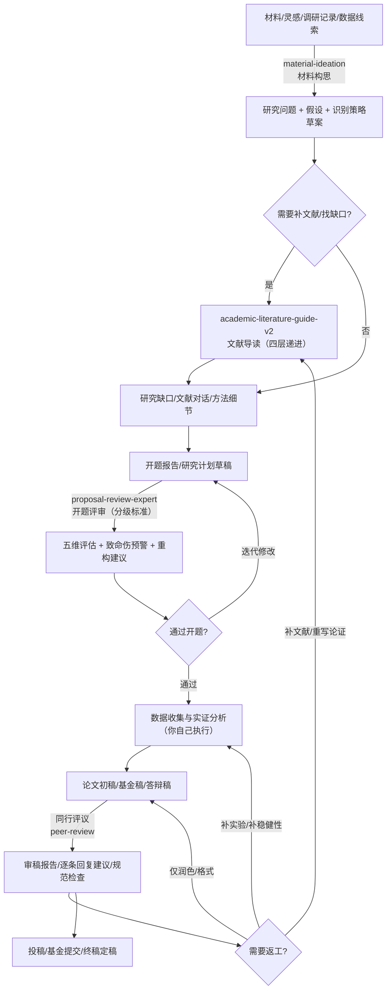

# LobsterAI / OpenClaw / CoPaw 技能包合集

本仓库提供多个可直接导入 LobsterAI / OpenClaw / CoPaw 的技能包，覆盖「文献导读」「开题评审」「同行评议」「基于材料的研究构思」等高频场景。

[](https://opensource.org/licenses/MIT)
[](https://nodejs.org/)
[](#)

---

## 🎯 技能清单

| 技能包                          |  版本 | 一句话说明                                                | 适用输入                       | 关键依赖/可选增强                        | 默认输出                     |
| ------------------------------- | ----: | --------------------------------------------------------- | ------------------------------ | ---------------------------------------- | ---------------------------- |
| `academic-literature-guide-v2/` | 2.0.0 | PDF/URL → 四层递进式文献导读（直觉→概念→技术→批判）       | PDF、URL、DOI/标题             | MinerU；可做 Web Search 验证             | `./文献导读/`                |
| `proposal-review-expert/`       | 1.0.0 | 开题报告分级评审（本科/硕士/博士）+ 致命伤预警 + 重构建议 | PDF、纯文本                    | 可选 MinerU；可选 AnythingLLM RAG        | `./开题报告评审/`            |
| `同行评议/`                     |     — | 同行评审/审稿意见回复：方法学、统计严谨性、规范与回复模板 | 论文全文、审稿意见、基金申请书 | 报告规范清单（CONSORT/STROBE/PRISMA 等） | 对话输出（可整理为审稿报告） |
| `material-ideation/`            |     — | 材料/文件夹 → 研究问题 + 假设 + 识别策略                  | 文件夹、PDF/Word/MD            | 依赖本地文件读取；可选 RAG               | `./研究构想/<材料名称>/`     |

---

## 🧭 科研流程图（四技能协作）

下面按“做科研”的典型顺序，把 4 个技能串起来（其中“数据收集/实证分析/写作排版”等环节通常由你自己完成或用其他工具完成）。



## ✅ 触发条件（除 mineru）

下表来自各技能 `SKILL.md` 中的【触发场景 / 触发关键词】描述，用于你快速判断“该用哪个技能”。

| 技能                                       | 触发场景                                                                  | 触发关键词（示例）                                                                                                                     | 典型指令（示例）                                                                          |
| ------------------------------------------ | ------------------------------------------------------------------------- | -------------------------------------------------------------------------------------------------------------------------------------- | ----------------------------------------------------------------------------------------- |
| `academic-literature-guide-v2`（文献导读） | 上传 PDF；提供论文链接；请求解读文献；需要文献导读报告                    | 帮我读懂这篇、解读 PDF、生成导读、literature guide、explain this paper、一键导读、自动导读                                             | `帮我解读这篇 PDF：...` / `帮我解读这个链接的论文：...`                                   |
| `proposal-review-expert`（开题评审）       | 上传开题报告 PDF/文本；请求评审开题；开题评估；研究计划审核               | 开题评审、开题报告、评审这个开题、开题评估、proposal review、research proposal、开题答辩、评审 PDF                                     | `评审这份开题报告（硕士层次）...` / `评审这份开题，启用 RAG`                              |
| `peer-review`（同行评议）                  | 期刊审稿；基金评审；稿件修改；回复审稿意见（Response/Rebuttal）           | 同行评议、同行评审（核心触发）；审稿意见、response to reviewers、rebuttal、投稿、修改说明（常见表述）                                  | `请对这篇论文进行同行评议：...` / `帮我逐条回复以下审稿意见：...`                         |
| `material-ideation`（材料构思）            | 用户提供具体材料（文件夹/文件路径），并请求基于材料提出研究问题/假设/识别 | 帮我看看这些材料能做什么研究、基于材料提出研究问题、有什么因果识别思路、从这些文献里提炼研究假设、读一下这个文件夹里的文件帮我构思研究 | `读一下这个文件夹里的文件，帮我构思研究：...` / `基于这些材料提出研究问题与识别策略：...` |

### proposal vs 同行评议：怎么避免用错？

- **proposal-review-expert（开题评审）**：研究开始前的“计划阶段”评审，核心是“研究问题是否成立、设计是否可执行、层级标准（本科/硕士/博士）是否匹配”。  
  - 典型触发：开题/答辩/研究计划/Proposal/课题申请/硕士博士层级
- **peer-review（同行评议）**：研究完成后的“投稿/修改阶段”评审，核心是“证据是否充分、方法与统计是否严谨、写作与报告规范是否合规、审稿意见如何逐条回复”。  
  - 典型触发：审稿/审稿意见/Response/Rebuttal/投稿/修改说明/Manuscript
- **基金评审怎么选**：更像“委员会审稿/专家评审”（国自然/社科基金/基金申请书评估）→ `peer-review`；更像“学生开题/研究计划审核”→ `proposal-review-expert`

---

## 🚀 安装与验证

### 前置要求

- [OpenClaw / LobsterAI](https://github.com/openclaw/openclaw) 已安装并运行
- 如需处理 PDF/图片/网页提取：安装 MinerU CLI（`mineru-open-api`）
- 如需 `proposal-review-expert` 启用 RAG：本地或远程可访问的 AnythingLLM（可选）

### 1) 安装 MinerU CLI（推荐）

```bash
npm install -g mineru-open-api
```

macOS/Linux 如遇到权限问题：

```bash
npm install -g mineru-open-api --prefix ~/.local
```

### 2) 安装技能包（复制目录）

macOS / Linux：

```bash
cp -r academic-literature-guide-v2 material-ideation proposal-review-expert ~/Library/Application\ Support/LobsterAI/SKILLs/
```

Windows（PowerShell）：

```powershell
Copy-Item -Path "academic-literature-guide-v2","material-ideation","proposal-review-expert" -Destination "$env:APPDATA\LobsterAI\SKILLs\" -Recurse
```

如果 LobsterAI 已在运行，重启一次以刷新技能列表。

### 2.1) 安装 CoPaw 技能（同行评议）

`同行评议/` 为 CoPaw workspace 技能目录结构（与 OpenClaw/LobsterAI 的 `SKILLs/` 不同）。

macOS / Linux（默认工作目录 `~/.copaw/`）：

```bash
mkdir -p ~/.copaw/skills
cp -r 同行评议 ~/.copaw/skills/
```

Windows（PowerShell，默认工作目录 `%USERPROFILE%\.copaw\`）：

```powershell
New-Item -ItemType Directory -Force -Path "$env:USERPROFILE\.copaw\skills" | Out-Null
Copy-Item -Path "同行评议" -Destination "$env:USERPROFILE\.copaw\skills\" -Recurse
```

### 3) 验证安装

在 LobsterAI 中分别发送：

```
文献导读技能
```

```
开题报告评审
```

```
材料构思
```

在 CoPaw 中（Console 或已连接的 Channel）发送：

```
同行评议
```

---

## 📖 使用方法（示例）

### 1) 文献导读助手（`academic-literature-guide-v2`）

```
帮我解读这篇 PDF：/path/to/paper.pdf
```

```
帮我解读这个链接的论文：https://arxiv.org/pdf/2509.22186
```

### 2) 开题报告评审专家（`proposal-review-expert`）

```
评审这份开题报告（硕士层次）
[粘贴开题报告全文]
```

```
评审这份开题，启用 RAG
```

### 3) 材料构思（`material-ideation`）

```
读一下这个文件夹里的文件，帮我构思研究：/path/to/materials/
```

```
基于这些材料提出研究问题、假设与识别策略：/path/to/materials/
```

### 4) 同行评议（`peer-review`）

```
请对这篇论文进行同行评议：[粘贴论文内容或上传 PDF]
```

```
帮我逐条回复以下审稿意见：...
```

---

## 📦 仓库结构

```
myskill/
├── academic-literature-guide-v2/
├── material-ideation/
├── 同行评议/
├── proposal-review-expert/
├── 安装指南.md
├── 使用说明.md
├── PUSH_GUIDE.md
├── README.md
└── .gitignore
```

---

## 📚 文档入口

| 文档                                                                               | 说明                             |
| ---------------------------------------------------------------------------------- | -------------------------------- |
| [安装指南.md](./安装指南.md)                                                       | 文献导读助手：3 分钟快速安装     |
| [使用说明.md](./使用说明.md)                                                       | 文献导读助手：最佳实践与故障排查 |
| [academic-literature-guide-v2/README.md](./academic-literature-guide-v2/README.md) | 文献导读助手：完整文档           |
| [material-ideation/SKILL.md](./material-ideation/SKILL.md)                         | 材料构思：工作流与输出规范       |
| [同行评议/README.md](./同行评议/README.md)                                         | 同行评议：适用场景与使用示例     |
| [同行评议/CHANGES.md](./同行评议/CHANGES.md)                                       | 同行评议：更新记录               |
| [proposal-review-expert/README.md](./proposal-review-expert/README.md)             | 开题报告评审专家：完整文档       |

---

## 🔗 相关链接

- [OpenClaw / LobsterAI](https://github.com/openclaw/openclaw)
- [MinerU](https://mineru.net)
- [ClawHub](https://clawhub.com)
