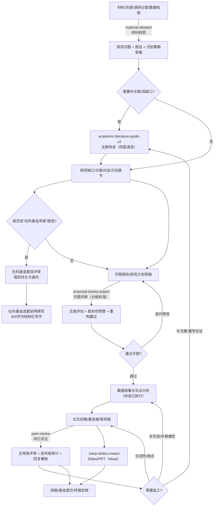

# 科研技能包合集（OpenClaw / LobsterAI + QwenPaw/CoPaw）

面向“做科研”的完整工作流技能包：从材料驱动的选题，到文献导读、开题评审、同行评议，再到 Marp 幻灯片产出；同时提供 RAGflow 知识库问答客户端用于资料检索与引用。

[](https://opensource.org/licenses/MIT)
[](#)

---

## 🎯 技能清单

| 技能包                          |  版本 | 一句话说明                                                                 | 适用输入                        | 关键依赖/可选增强                             | 默认输出                      |
| ------------------------------- | ----: | -------------------------------------------------------------------------- | ------------------------------- | -------------------------------------------- | ----------------------------- |
| `academic-literature-guide-v2/` | 2.0.0 | PDF/URL → 四层递进式文献导读（直觉→概念→技术→批判）                        | PDF、URL、DOI/标题              | 可选：检索验证（Web Search）                  | `./文献导读/`                 |
| `proposal-review-expert/`       | 1.0.0 | 开题报告分级评审（本科/硕士/博士）+ 致命伤预警 + 重构建议                  | PDF、纯文本                     | 可选：RAG 验证（AnythingLLM 等）              | `./开题报告评审/`             |
| `peer-review/`                  | 2.0.0 | 同行评议/审稿意见回复：双轨评审（正常/批判）+ 原则 + 模板                  | 论文全文、审稿意见、基金申请书  | 参考规范与模板（见 `templates.md` 等）        | 对话输出（可整理为审稿报告）  |
| `社科基金题目评审/`             | 0.1.0 | 社科基金申报题目评审：规范性/创新性/可行性 + 一票否决项                    | 题目文本（1–3 个备选更佳）      | 适配“基金申报”写作场景                        | 对话输出（含改写建议）        |
| `社科基金选题说明撰写指南/`     | 0.1.0 | 社科基金“选题说明”（500 字以内）结构化写作与范例                           | 选题信息/要点/政策依据          | 适配“基金申报”写作场景                        | 对话输出（可直接粘贴）        |
| `material-ideation/`            |     — | 材料/文件夹 → 研究问题 + 假设 + 识别策略                                   | 文件夹、PDF/Word/MD             | 依赖本地文件读取；可选 RAG                    | `./研究构想/<材料名称>/`      |
| `marp-slides-creator/`          | 0.1.0 | Marp Slides 一条龙：内容消化→出稿→审阅→导出（HTML/PDF），含主题选择与适配 | 论文/笔记/大纲/Markdown         | 需要 Node.js（`npx @marp-team/marp-cli`）     | `slides_<项目名>/05_final/`   |
| `ragflow-client/`               | 2.0.0 | RAGflow 知识库问答：走 OpenAI 兼容 API，可返回引用来源                     | 问题文本                        | 需要 RAGflow（Host + API Key + Chat ID）      | 对话输出（可含引用来源）      |

---

## 🧭 科研流程图（主线 + 分支）



## 🚀 快速开始（安装与验证）

本仓库同时包含两种技能生态：

- OpenClaw / LobsterAI：拷贝到 `SKILLs/` 目录即可加载
- QwenPaw/CoPaw：拷贝到 `~/.copaw/skills/`（或 Windows 的 `%USERPROFILE%\.copaw\skills\`）并在控制台启用

### 1) 安装 OpenClaw / LobsterAI（4 个）

macOS / Linux：

```bash
cp -r academic-literature-guide-v2 material-ideation proposal-review-expert marp-slides-creator ~/Library/Application\ Support/LobsterAI/SKILLs/
```

Windows（PowerShell）：

```powershell
Copy-Item -Path "academic-literature-guide-v2","material-ideation","proposal-review-expert","marp-slides-creator" -Destination "$env:APPDATA\LobsterAI\SKILLs\" -Recurse
```

### 2) 安装 QwenPaw/CoPaw（同行评议 + 社科基金写作 + RAGflow）

macOS / Linux（默认工作目录 `~/.copaw/`）：

```bash
mkdir -p ~/.copaw/skills
cp -r peer-review 社科基金题目评审 社科基金选题说明撰写指南 ragflow-client ~/.copaw/skills/
```

Windows（PowerShell，默认工作目录 `%USERPROFILE%\.copaw\`）：

```powershell
New-Item -ItemType Directory -Force -Path "$env:USERPROFILE\.copaw\skills" | Out-Null
Copy-Item -Path "peer-review","社科基金题目评审","社科基金选题说明撰写指南","ragflow-client" -Destination "$env:USERPROFILE\.copaw\skills\" -Recurse
```

### 3) 快速验证

在 LobsterAI 中分别发送：

```
文献导读技能
```

```
开题报告评审
```

```
材料构思
```

```
制作slides
```

在 QwenPaw/CoPaw（Console 或已连接的 Channel）中发送：

```
同行评议
```

```
题目评审
```

```
选题说明
```

```
ragflow-client
```

---

## 🧩 Marp Slides（已更新）

`marp-slides-creator/` 适合把论文/大纲/笔记转换成“能讲”的演示文稿，并导出 HTML/PDF：

- 工作流固定为：内容分析 → 结构化大纲 → 出稿 → 多维审阅 → `05_final/` 终稿输出
- 内置主题库：见 [themes/README.md](./marp-slides-creator/themes/README.md)
- 模板：
  - 中文模板：`marp-slides-creator/marp-template-zh.md`
  - 英文模板：`marp-slides-creator/marp-template.md`
- 不同主题对标题语法有要求（例如 `beam/academic/jobs` 需要用 `#` 作为内容页标题）；规则与示例见主题文档

示例：

```
把这篇论文做成 10 页 slides（主题 academic），并导出 HTML 与 PDF：
[粘贴论文内容/大纲]
```

---

## 📖 使用示例（最常用）

### 1) 文献导读（`academic-literature-guide-v2`）

```
帮我解读这篇 PDF：/path/to/paper.pdf
```

### 2) 开题报告评审（`proposal-review-expert`）

```
评审这份开题报告（硕士层次）
[粘贴开题报告全文]
```

### 3) 同行评议 / Rebuttal（`peer-review`）

```
我收到了审稿意见，帮我逐条写回复（中英文各一份）：...
```

### 4) RAGflow 知识库问答（`ragflow-client`）

```
用 ragflow 知识库回答，并给出引用来源：...
```

---

## 📦 仓库结构

```text
myskill/
├── academic-literature-guide-v2/
├── marp-slides-creator/
├── material-ideation/
├── peer-review/
├── proposal-review-expert/
├── ragflow-client/
├── 社科基金题目评审/
├── 社科基金选题说明撰写指南/
├── 安装指南.md
├── 使用说明.md
└── README.md
```

---

## 📚 文档入口

| 文档                                                                               | 说明                             |
| ---------------------------------------------------------------------------------- | -------------------------------- |
| [安装指南.md](./安装指南.md)                                                       | 文献导读助手：3 分钟快速安装     |
| [使用说明.md](./使用说明.md)                                                       | 文献导读助手：最佳实践与故障排查 |
| [academic-literature-guide-v2/README.md](./academic-literature-guide-v2/README.md) | 文献导读助手：完整文档           |
| [proposal-review-expert/README.md](./proposal-review-expert/README.md)             | 开题报告评审专家：完整文档       |
| [peer-review/README.md](./peer-review/README.md)                                   | 同行评议：使用说明（v2.0）       |
| [peer-review/templates.md](./peer-review/templates.md)                             | 同行评议：输出模板与回复模板     |
| [peer-review/references.md](./peer-review/references.md)                           | 同行评议：参考规范与检查清单     |
| [marp-slides-creator/SKILL.md](./marp-slides-creator/SKILL.md)                     | Marp Slides：完整工作流          |
| [themes/README.md](./marp-slides-creator/themes/README.md)                          | Marp Slides：内置主题清单        |
| [ragflow-client/SKILL.md](./ragflow-client/SKILL.md)                               | RAGflow Client：配置与用法        |
| [社科基金题目评审/SKILL.md](./社科基金题目评审/SKILL.md)                             | 社科基金题目评审：规则与评审框架 |
| [社科基金选题说明撰写指南/SKILL.md](./社科基金选题说明撰写指南/SKILL.md)             | 社科基金选题说明：三层结构与范式 |

---

## 🔗 相关链接

- [OpenClaw / LobsterAI](https://github.com/openclaw/openclaw)
- [ClawHub](https://clawhub.com)
