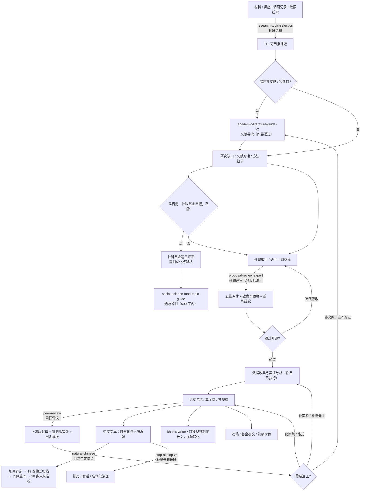

# 科研与中文写作技能包合集（OpenClaw / LobsterAI / CoPaw / OpenSpace）

本仓库是一组围绕「做科研全流程 + 中文写作增强」的 Agent 技能（skill）合集：从材料构思、文献导读、社科基金申报，到开题评审、同行评议、文献综述写作、口播视频制作，以及「自然中文协议」这一中文写作人味增强能力、Mem0 长期记忆管理与 OpenSpace 技能发现/委派。

[](https://opensource.org/licenses/MIT)
[](#)

---

## 技能清单

| 技能包 | 版本 | 一句话说明 | 适用输入 | 关键依赖 / 可选增强 | 默认输出 |
| --- | ---: | --- | --- | --- | --- |
| `natural-chinese/` | 2.0.0 | 自然中文协议：界定场景→扫 19 类机器味→同频重写→28 条人味自检 | 中文文本（公文/学术/商业/新闻/新媒体/文学） | 内置 patterns / scenarios / injection / self-check | 对话输出（润色稿） |
| `academic-literature-guide-v2/` | 2.1.0 | PDF/URL → 四层递进式文献导读（直觉→概念→技术→批判） | PDF、URL、DOI/标题 | 可选：检索验证（Web Search）；PDF 提取（mineru-open-api CLI） | `./文献导读/` |
| `research-topic-selection/` | 1.5.2 | AI 辅助科研选题：材料→外部检索→好问题压力测试→3+2 可申报课题 | 文件夹、PDF/Word/MD | 依赖本地文件读取；可选 RAG | `./研究构想/<材料>/` |
| `proposal-review-expert/` | 2.0.0 | 开题报告分级评审（本科/硕士/博士）+ 致命伤预警 + 重构建议 | PDF、纯文本 | 可选：PDF 提取（mineru-open-api CLI）、RAG 验证 | `./开题报告评审/` |
| `peer-review/` | 2.0.0 | 同行评议/审稿意见回复：双轨评审（正常/批判）+ 原则 + 模板 | 论文全文、审稿意见、基金申请书 | 参考规范与模板（见 `templates.md` 等） | 对话输出（可整理为审稿报告） |
| `social-science-fund-topic-guide/` | — | 社科基金「选题说明」（500 字以内）结构化写作与范例 | 选题信息/要点/政策依据 | 适配「基金申报」写作场景 | 对话输出（可直接粘贴） |
| `社科基金题目评审/` | — | 社科基金申报题目评审：规范性/创新性/可行性 + 一票否决项 | 题目文本（1–3 个备选更佳） | 适配「基金申报」写作场景 | 对话输出（含改写建议） |
| `khazix-writer/` | — | 公众号长文写作（按卡兹克风格出稿/续写/扩写，含句式重复检测） | 素材、PDF、brief、新闻链接、语音转写 | — | 对话输出（长文） |
| `口播视频制作/` | 1.0.0 | 文章→口播稿→克隆语音→动画画面→MP4 视频 | 文章/口播稿 | HyperFrames、小米 MiMo TTS、FFmpeg | `*.mp4` |
| `coefplot/` | — | Stata coefplot 回归系数作图专家（多模型/边际效应/排序） | Stata 命令 / 数据 | Stata + coefplot 包 | Stata 图形 |
| `stop-ai-slop-zh/` | — | 识别并消除中文 AI 写作痕迹（套话/排比/名词化/八股） | 中文文本 | 与 `natural-chinese` 互补（轻量版） | 对话输出（修订稿） |
| `mem0-memory-flow/` | — | Mem0 长期记忆：建议/审核/上传/召回（用户确认工作流） | 记忆条目 | Mem0 服务 | 记忆库更新 |
| `skill-discovery/` | — | 本地检索可复用 OpenSpace 技能，必要时逐步浏览云端包 | 需求描述 | OpenSpace | 技能推荐 |
| `delegate-task/` | — | 将任务委派给 OpenSpace 自主工作节点（编码/DevOps/调研/桌面自动化） | 任务描述 | OpenSpace | 任务结果 |
| `ragflow-client/` | 2.0.0 | RAGflow 知识库问答：走原生对话 API，可返回引用来源 | 问题文本 | 需要 RAGflow（API Key + Chat ID + Host） | 对话输出（可含引用来源） |

---

## 科研 + 写作流程图

下面按「做科研」的典型顺序，把核心技能串起来，并在「中文写作增强」分支重点突出 `natural-chinese` 与 `stop-ai-slop-zh`。


```mermaid
flowchart TD
  A[材料 / 灵感 / 调研记录 / 数据线索] -->|research-topic-selection\n科研选题| B[3+2 可申报课题]

  B --> C{需要补文献 / 找缺口?}
  C -->|是| D[academic-literature-guide-v2\n文献导读（四层递进）]
  D --> E[研究缺口 / 文献对话 / 方法细节]
  C -->|否| E

  E --> S{是否走「社科基金申报」路径?}
  S -->|是| T[社科基金题目评审\n题目优化与避坑]
  T --> U[social-science-fund-topic-guide\n选题说明（500 字内）]
  S -->|否| F

  E --> F[开题报告 / 研究计划草稿]
  F -->|proposal-review-expert\n开题评审（分级标准）| G[五维评估 + 致命伤预警 + 重构建议]
  G --> H{通过开题?}
  H -->|迭代修改| F
  H -->|通过| I[数据收集与实证分析（你自己执行）]

  I --> J[论文初稿 / 基金稿 / 答辩稿]
  J -->|peer-review\n同行评议| K[正常版评审 + 批判版审计 + 回复模板]
  K --> L{需要返工?}
  L -->|补实验 / 补稳健性| I
  L -->|补文献 / 重写论证| D
  L -->|仅润色 / 格式| J

  J --> Q[中文文本：自然化与人味增强]
  Q -->|natural-chinese\n自然中文协议| Q1[场景界定 → 19 类模式扫描\n→ 同频重写 → 28 条人味自检]
  Q -->|stop-ai-slop-zh\n轻量去机器味| Q2[排比 / 套话 / 名词化清理]

  J --> V[khazix-writer / 口播视频制作\n长文 / 视频转化]
  J --> M[投稿 / 基金提交 / 终稿定稿]
```

---

## 触发条件

下表来自各技能 `SKILL.md` 中的【触发场景 / 触发关键词】描述，用于快速判断「该用哪个技能」。

| 技能 | 触发场景 | 触发关键词（示例） | 典型指令（示例） |
| --- | --- | --- | --- |
| `natural-chinese`（自然中文协议） | 中文文本去机器味、立人味；公文/学术/商业/新闻/新媒体/文学六场景润色 | 自然中文、去 AI 痕迹、AI味、人味、同频重写、润色 | `把这篇公众号改得人味一点：...` / `用学术体润色这段摘要：...` |
| `academic-literature-guide-v2`（文献导读） | 上传 PDF；提供论文链接；请求解读文献；需要文献导读报告 | 帮我读懂这篇、解读 PDF、生成导读、literature guide、explain this paper、一键导读 | `帮我解读这篇 PDF：...` / `帮我解读这个链接的论文：...` |
| `research-topic-selection`（科研选题） | 用户提供具体材料并请求基于材料提出研究选题/课题 | 科研选题、帮我选题、从材料出发找课题、好问题压力测试 | `读一下这个文件夹，帮我做科研选题：...` |
| `proposal-review-expert`（开题评审） | 上传开题报告 PDF/文本；请求评审开题；开题评估 | 开题评审、开题报告、评审这个开题、proposal review、research proposal | `评审这份开题报告（硕士层次）...` |
| `peer-review`（同行评议） | 期刊审稿；基金评审；稿件修改；回复审稿意见 | 同行评议、审稿意见、response to reviewers、rebuttal、投稿 | `请对这篇论文进行同行评议：...` / `帮我逐条回复以下审稿意见：...` |
| `social-science-fund-topic-guide`（选题说明） | 撰写「选题说明」（500 字以内） | 选题说明、选题依据、社科基金选题、课题论证 | `按 500 字以内写一段选题说明：...` |
| `社科基金题目评审` | 申报题目把关与改写 | 题目评审、评审题目、看看这个题目、申报题目 | `帮我评审这 3 个社科基金题目：...` |
| `khazix-writer`（公众号长文） | 撰写/续写公众号长文（含句式重复检测） | 写文章、写稿子、帮我写、按我的风格写、公众号文章 | `用我的风格把这篇素材写成文章：...` |
| `口播视频制作` | 把文章/口播稿转成口播视频 | 口播视频、文章转视频、口播稿、动画视频 | `把这篇文章做成口播视频：...` |
| `coefplot`（Stata 作图） | 在 Stata 中绘制回归系数图 | coefplot、系数图、回归系数可视化、边际效应图 | `用 coefplot 画这个回归的系数图：...` |
| `stop-ai-slop-zh`（去 AI 味） | 轻量清理中文 AI 写作痕迹 | 去 AI 味、AI 痕迹、套话、排比 | `帮我去掉这段中文的 AI 味：...` |
| `mem0-memory-flow`（记忆管理） | 需要建议/审核/上传/召回长期记忆 | 记一下、保存到记忆、回忆一下、mem0 | `把这条偏好记到记忆里：...` |
| `skill-discovery` / `delegate-task`（OpenSpace） | 检索本地/云端技能；委派任务给自主工作节点 | openspace、找技能、委派任务、delegate | `帮我找一个能做 X 的技能` / `把这个任务委派给 OpenSpace：...` |
| `ragflow-client`（知识库问答） | 需要向 RAGflow 知识库提问；回答带引用来源 | ragflow、知识库问答、查知识库、带引用 | `用 ragflow 知识库回答，并给出引用来源：...` |

### proposal vs 同行评议：怎么避免用错？

- **proposal-review-expert（开题评审）**：研究开始前的「计划阶段」评审，核心是「研究问题是否成立、设计是否可执行、层级标准（本科/硕士/博士）是否匹配」。
  - 典型触发：开题/答辩/研究计划/Proposal/课题申请/硕士博士层级
- **peer-review（同行评议）**：研究完成后的「投稿/修改阶段」评审，核心是「证据是否充分、方法与统计是否严谨、写作与报告规范是否合规、审稿意见如何逐条回复」。
  - 典型触发：审稿/审稿意见/Response/Rebuttal/投稿/修改说明/Manuscript
- **基金评审怎么选**：更像「委员会审稿/专家评审」（国自然/社科基金/基金申请书评估）→ `peer-review`；更像「学生开题/研究计划审核」→ `proposal-review-expert`

### 中文去 AI 味：natural-chinese vs stop-ai-slop-zh

- **`natural-chinese`（推荐默认）**：四步流程（界定场景→扫 19 类机器味→同频重写→28 条人味自检），区分六种语体场景，强调「先破机器味、再立人味」，避免矫枉过正的电报体。需要打磨正式交付物时优先用它。
- **`stop-ai-slop-zh`**：轻量快速清理，主打排比/套话/名词化/八股结构。适合时间紧张或只需粗扫的场景。
- 两者不互斥：先 `stop-ai-slop-zh` 做粗扫，再 `natural-chinese` 做精修。

---

## 安装与验证

### 前置要求

- [OpenClaw / LobsterAI](https://github.com/openclaw/openclaw) 已安装并运行；或 CoPaw / OpenSpace 运行环境就绪
- 如需启用 RAG / RAGflow / Mem0 / OpenSpace 等增强能力，需配置相应的 API Key 与服务地址

### 1) 安装 OpenClaw / LobsterAI 技能

macOS / Linux：

```bash
cp -r natural-chinese academic-literature-guide-v2 research-topic-selection \
      proposal-review-expert peer-review social-science-fund-topic-guide \
      社科基金题目评审 stop-ai-slop-zh khazix-writer 口播视频制作 \
      ~/Library/Application\ Support/LobsterAI/SKILLS/
```

Windows（PowerShell）：

```powershell
Copy-Item -Path "natural-chinese","academic-literature-guide-v2","research-topic-selection","proposal-review-expert","peer-review","social-science-fund-topic-guide","社科基金题目评审","stop-ai-slop-zh","khazix-writer","口播视频制作" -Destination "$env:APPDATA\LobsterAI\SKILLS\" -Recurse
```

### 2) 安装 OpenSpace / CoPaw 技能

`peer-review/`、`ragflow-client/`、`delegate-task/`、`skill-discovery/` 等为 OpenSpace / CoPaw workspace 技能目录结构。

macOS / Linux（默认工作目录 `~/.copaw/` 或 OpenSpace 对应目录）：

```bash
mkdir -p ~/.copaw/skills
cp -r peer-review ragflow-client delegate-task skill-discovery ~/.copaw/skills/
```

Windows（PowerShell，默认工作目录 `%USERPROFILE%\.copaw\`）：

```powershell
New-Item -ItemType Directory -Force -Path "$env:USERPROFILE\.copaw\skills" | Out-Null
Copy-Item -Path "peer-review","ragflow-client","delegate-task","skill-discovery" -Destination "$env:USERPROFILE\.copaw\skills\" -Recurse
```

### 3) 验证安装

在对应 Agent 中分别发送触发关键词（如「自然中文」「文献导读」「科研选题」「开题报告评审」「同行评议」「选题说明」「题目评审」「coefplot」「去 AI 味」「ragflow 知识库问答」），确认技能被正确路由。

---

## 使用方法（示例）

### 1) 自然中文协议（`natural-chinese`）

```
用学术体润色这段中文摘要，让它读起来像人写的：...
```

```
把这段公众号文章改成新媒体语体，去掉机器味、加点人味：...
```

### 2) 文献导读助手（`academic-literature-guide-v2`）

```
帮我解读这篇 PDF：/path/to/paper.pdf
```

```
帮我解读这个链接的论文：https://arxiv.org/pdf/2509.22186
```

### 3) 科研选题（`research-topic-selection`）

```
读一下这个文件夹里的文件，帮我做科研选题：/path/to/materials/
```

### 4) 开题报告评审专家（`proposal-review-expert`）

```
评审这份开题报告（硕士层次）
[粘贴开题报告全文]
```

### 5) 同行评议（`peer-review`）

```
请对这篇论文进行同行评议：[粘贴论文内容或上传 PDF]
```

```
我收到了审稿意见，帮我写逐条回复（中英文各一份）：...
```

### 6) 社科基金题目评审 / 选题说明

```
帮我评审并改写下面 3 个社科基金申报题目（要求：不超过30字、无副标题、核心概念不超过4个）：
1) ...
2) ...
3) ...
```

```
请按「选题依据→具体问题→研究视角与方法」的三层结构，写一段 500 字以内的社科基金选题说明：
- 题目：...
- 现实背景/政策依据：...
- 具体问题：...
- 研究视角与方法：...
```

### 7) 中文润色 / 公众号长文 / 口播视频

```
帮我去掉这段中文的 AI 味：...
```

```
用卡兹克的风格把这篇素材写成公众号长文：...
```

```
把这篇文章做成口播视频：...
```

---

## 仓库结构

```
myskill/
├── natural-chinese/                  # 自然中文协议（2.0.0）★ 新增
├── academic-literature-guide-v2/      # 文献导读（2.1.0）
├── research-topic-selection/          # 科研选题（1.5.2）
├── proposal-review-expert/            # 开题评审（2.0.0）
├── peer-review/                      # 同行评议（2.0.0）
├── social-science-fund-topic-guide/   # 社科基金选题说明
├── 社科基金题目评审/                 # 社科基金题目评审
├── khazix-writer/                     # 公众号长文写作
├── 口播视频制作/                      # 口播视频（1.0.0）
├── coefplot/                          # Stata 系数图
├── stop-ai-slop-zh/                   # 中文去 AI 味（轻量）
├── mem0-memory-flow/                  # Mem0 记忆管理
├── skill-discovery/                   # OpenSpace 技能发现
├── delegate-task/                     # OpenSpace 任务委派
├── ragflow-client/                    # RAGflow 知识库问答（2.0.0）
├── README.md
└── .gitignore
```

---

## 相关链接

- [OpenClaw / LobsterAI](https://github.com/openclaw/openclaw)
- [ClawHub](https://clawhub.com)
- [RAGflow](https://ragflow.io)
- [Mem0](https://mem0.ai)