# Stata coefplot 技能演示教程

> 基于 `sysuse auto.dta` 示例数据集，涵盖 coefplot 全部核心功能。每段代码独立可运行，逐段复制到 Stata 执行即可。
>
> **语言切换**：所有配图提供中英文双语版本。中文版在 `images_zh/`，英文版在 `images_en/`。默认展示中文，如需英文版，将图片路径中的 `images_zh/` 替换为 `images_en/` 即可。

---

## 准备工作

```stata
* 安装 coefplot（首次使用）
ssc install coefplot

* 安装 addplot（高级场景需要）
ssc install addplot

* 安装 estout（模型管理推荐）
ssc install estout
```

---

## 场景零：eststo 工作流（推荐）

用 `eststo` 管理模型是实证论文的标准做法，比 `estimates store` 更简洁。

```stata
sysuse auto, clear
eststo clear

* 逐步添加变量
eststo m1: regress price mpg
eststo m2: regress price mpg trunk
eststo m3: regress price mpg trunk length
eststo m4: regress price mpg trunk length turn

* 先看表格
esttab, se star(* 0.1 ** 0.05 *** 0.01) b(3)

* 再画图（四模型对比）
coefplot m1 m2 m3 m4, drop(_cons) xline(0) ///
    plotlabels("m1" "m2" "m3" "m4") legend(rows(1))

* 按系数排序的森林图
coefplot m1 m2 m3 m4, drop(_cons) xline(0) ///
    sort(, descending) plotlabels("m1" "m2" "m3" "m4")
```

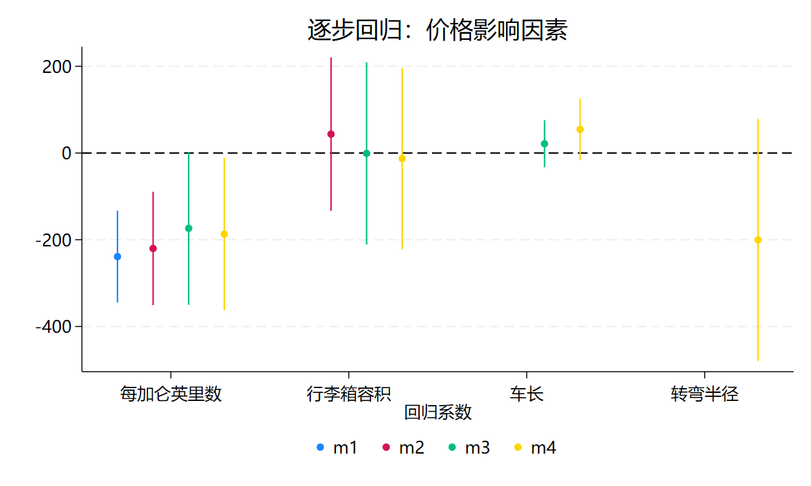

**关键点**：
- `eststo` 自动编号，也可以手动命名 `eststo mymodel:`
- `eststo clear` 清空已存储的模型
- `estimates dir` 查看已存储的模型列表
- `coefplot` 可以直接用 `eststo` 存储的名称调用

**与 esttab 的配合**：先用 `esttab` 生成回归表格（论文正文），再用 `coefplot` 生成系数图（附录/展示），两者共享同一套 `eststo` 存储的模型。

---

## 场景一：单模型基础图

### 1.1 基本用法

```stata
sysuse auto, clear
regress price mpg trunk length turn

* 水平布局，排除常数项，画零参考线
coefplot, drop(_cons) xline(0)
```

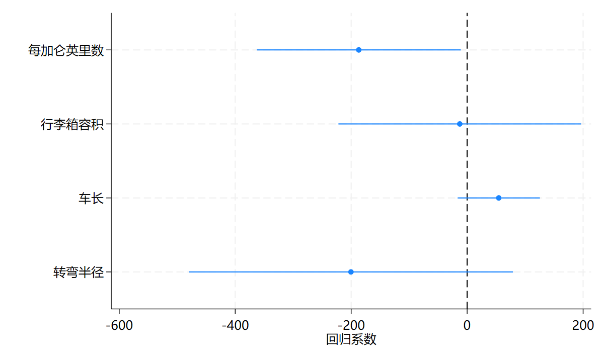

**结果**：Y 轴为变量名，X 轴为回归系数，每个系数一个点 + 95% CI 线，0 处有垂直参考线。

### 1.2 竖直布局

```stata
coefplot, vertical drop(_cons) yline(0) title("价格影响因素回归系数")

* 注意：竖直布局后参考线改为 yline(0)
```

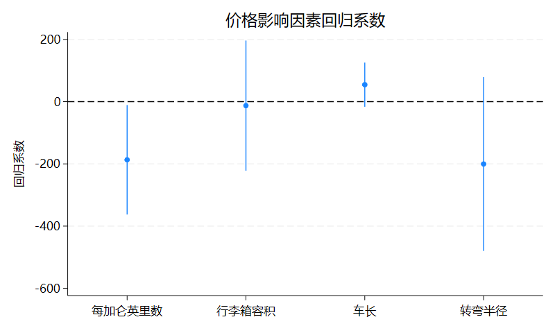

### 1.3 筛选系数

```stata
* 只保留 mpg 和 trunk
coefplot, keep(mpg trunk) xline(0)

* 用通配符
coefplot, keep(m* t*) xline(0)   // 保留 m 开头和 t 开头的系数
```

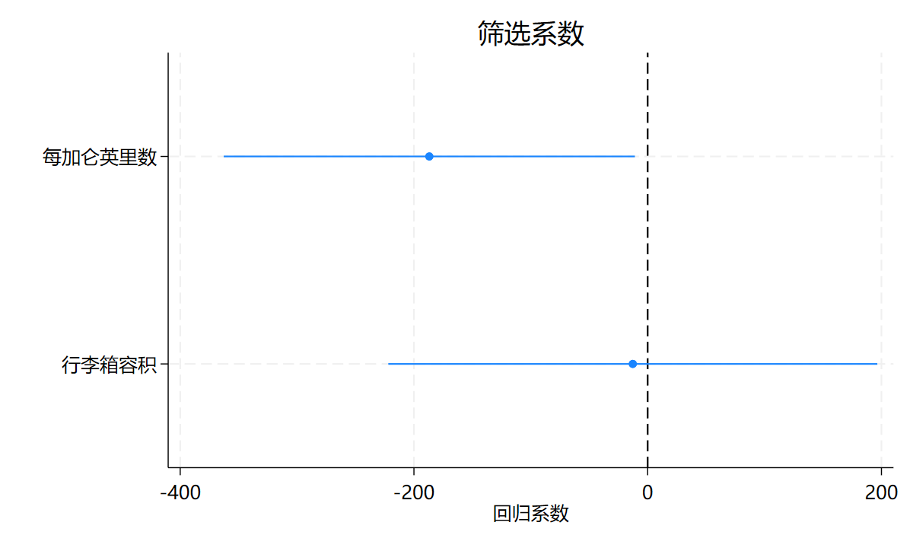

**关键点**：
- `drop(_cons)` 排除常数项
- `keep()` / `drop()` 用通配符筛选系数
- `xline(0)`（水平）或 `yline(0)`（竖直）画零参考线，判断显著性一目了然

---

## 场景二：多模型对比（国产 vs 进口）

### 2.1 基本对比

```stata
sysuse auto, clear

* 分样本回归
regress price mpg trunk length turn if foreign==0
estimates store Domestic

regress price mpg trunk length turn if foreign==1
estimates store Foreign

* 两模型并排
coefplot Domestic Foreign, drop(_cons) xline(0)
```

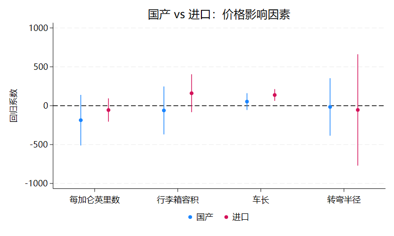

**结果**：国产（蓝）和进口（红）的系数点并排显示，偏移避免重叠。

### 2.2 添加图例与样式

```stata
* 方式一：括号内指定
coefplot (Domestic, label(国产车) pstyle(p3))          ///
         (Foreign,  label(进口车) pstyle(p4))          ///
       , drop(_cons) xline(0) msymbol(S)

* 方式二：用 p1() p2() 全局指定
coefplot Domestic Foreign, drop(_cons) xline(0) msymbol(S) ///
    p1(label(国产车) pstyle(p3))                          ///
    p2(label(进口车) pstyle(p4))
```

### 2.3 控制偏移量

```stata
* 关闭自动偏移（重叠显示）
coefplot Domestic Foreign, drop(_cons) xline(0) nooffsets

* 自定义偏移量（系数间距=1，偏移宜 -0.5 到 0.5）
coefplot (Domestic, offset(0.08)) (Foreign, offset(-0.08)) ///
    , drop(_cons) xline(0)
```

---

## 场景三：子图（按因变量拆分）

```stata
sysuse auto, clear

* 跑四个模型
regress price  mpg trunk length turn if foreign==0
estimates store D_price
regress price  mpg trunk length turn if foreign==1
estimates store F_price
regress weight mpg trunk length turn if foreign==0
estimates store D_weight
regress weight mpg trunk length turn if foreign==1
estimates store F_weight

* 两个子图并排（竖排，各自独立尺度）
coefplot (D_price, label(国产)) (F_price, label(进口)), bylabel(价格) ///
    || (D_weight) (F_weight), bylabel(重量) ///
    ||, vertical drop(_cons) yline(0) byopts(yrescale compact cols(1)) ///
    legend(rows(1) position(6))
```

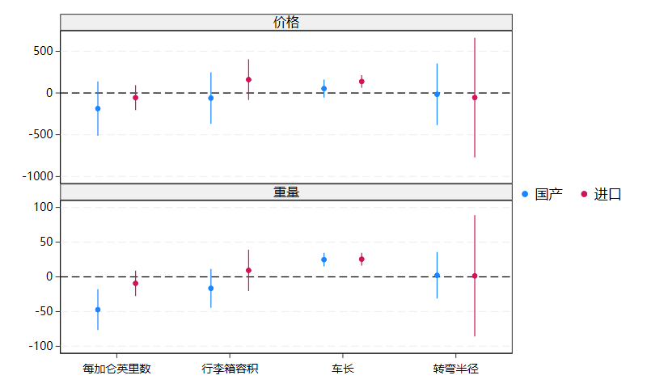

**关键点**：
- `||` 分隔子图
- `bylabel()` 标注子图标题
- `byopts(yrescale)` 允许子图用不同 Y 轴尺度（竖排时用 `yrescale`，横排时用 `xrescale`）
- `byopts(compact cols(1))` 改为上下排列
- 竖排比横排更节省纵向空间，推荐用于论文排版

---

## 场景四：按系数拆分面板（bycoefs）

bycoefs 将系数视为"子图"，适合跨模型比较同一变量。

```stata
sysuse auto, clear

* 跑三个维修记录分组的回归
forvalues i = 3/5 {
    quietly regress price mpg weight length turn if rep78==`i'
    estimates store rep_`i'
}

* 2×2 面板（竖排）
coefplot rep_3 || rep_4 || rep_5, vertical drop(_cons) yline(0) ///
    bycoefs byopts(yrescale compact cols(2))
```

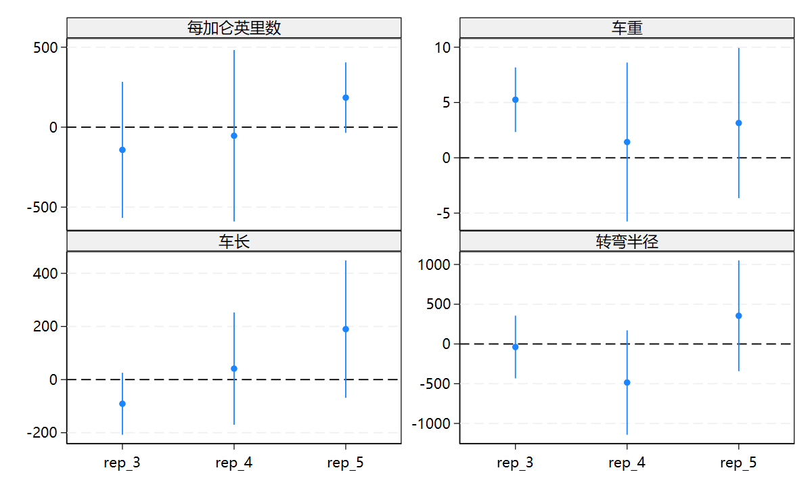

---

## 场景五：Odds Ratio（指数化）

```stata
sysuse auto, clear

logit foreign mpg trunk length turn

* Odds Ratio 图（参考线改为 xline(1)）
coefplot, drop(_cons) xline(1) eform xtitle("Odds Ratio (比值比)")

* 对比：原始 log odds vs OR（用 addplot 加子图参考线）
logit foreign mpg trunk length turn
estimates store logit_m

coefplot (logit_m, label(Log Odds))    ///
         (logit_m, label(Odds Ratio) eform) ///
    ||, drop(_cons) byopts(xrescale)
addplot 1:, xline(0) norescaling
addplot 2:, xline(1) norescaling
```

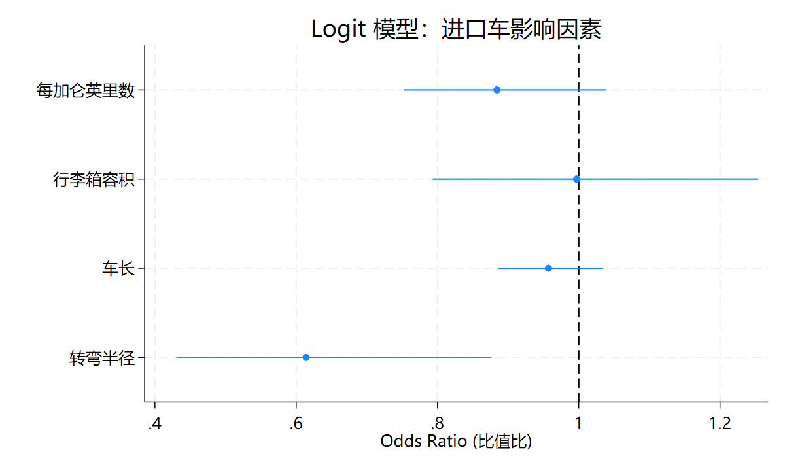

**关键点**：
- `eform` 自动 = `transform(* = exp(@))`
- logit → OR，stcox → HR，mlogit → RRR，poisson → IRR
- 变量较少时用横排，空间更充裕

---

## 场景六：多层级置信区间

```stata
sysuse auto, clear
regress price mpg trunk length turn

* 三级 CI（99%、95%、90%）
coefplot, vertical drop(_cons) yline(0) msymbol(S) mfcolor(white) ///
    levels(99 95 90) legend(order(1 "99%" 2 "95%" 3 "90%") rows(1))

* 从浅到深的多层级（Harrell 风格）
coefplot, vertical drop(_cons) yline(0) msymbol(d) mcolor(white) ///
    levels(99 95 90 80 70) legend(order(1 "99" 2 "95" 3 "90" 4 "80" 5 "70") rows(1)) ///
    ciopts(lwidth(3 ..) lcolor(*.2 *.4 *.6 *.8 *1))
```

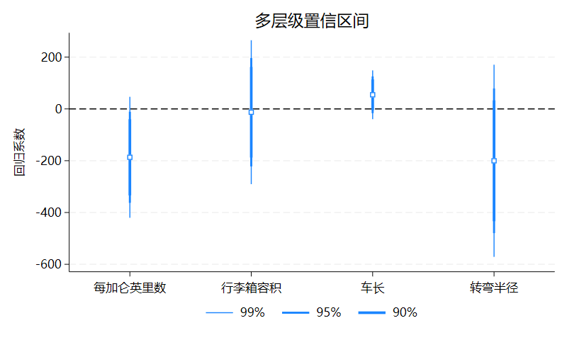

---

## 场景七：图形类型变换（recast）

### 7.1 条形图 + 带帽 CI

```stata
sysuse auto, clear

regress price mpg trunk length turn if foreign==0
estimates store D
regress price mpg trunk length turn if foreign==1
estimates store F

coefplot (D, label(国产)) (F, label(进口)), vertical drop(_cons) yline(0) ///
    recast(bar) ciopts(recast(rcap)) citop barwidth(0.3) ///
    legend(rows(1) position(6))
```

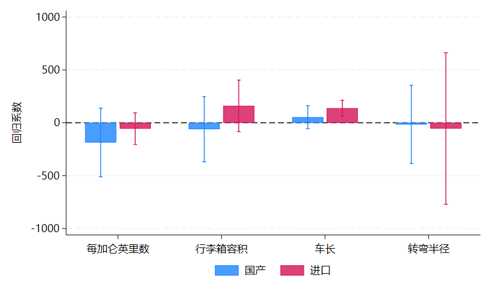

**关键点**：
- `recast(bar)` 点估计变为条形
- `ciopts(recast(rcap))` CI 变为带帽线
- `citop` CI 画在条形上面

### 7.2 条形图 + 数值标注

```stata
coefplot D F, vertical recast(bar) barwidth(0.3) fcolor(*.5) ///
    ciopts(recast(rcap)) citop format(%9.0f)                   ///
    addplot(scatter @b @at, ms(i) mlabel(@b) mlabpos(12) mlabcolor(black))
```

### 7.3 连线条形混合（双轴）

```stata
sysuse auto, clear
proportion rep78
estimates store prop
mean price, over(rep78)
estimates store mean

coefplot (prop, recast(bar) noci barwidth(0.5) color(*.6))         ///
         (mean, recast(connected) ciopts(recast(rcap)) axis(2))     ///
       , vertical nooffsets plotlabels("比例" "均价")               ///
       rename(^.*([0-9])\..+$ = \1, regex)                            ///
       xtitle("维修记录 1978") ytitle("比例") ytitle("价格($)", axis(2))
```

---

## 场景八：排序与标签

### 8.1 森林图（按效应大小排序）

```stata
sysuse auto, clear
regress price mpg trunk length turn

* 降序排列
coefplot, vertical drop(_cons) sort(, descending) yline(0) ///
    title("按效应大小降序排列（森林图）")
```

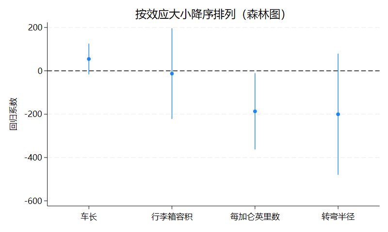

### 8.2 自定义标签

```stata
sysuse auto, clear
regress price mpg trunk length turn

coefplot, drop(_cons) xline(0)                                  ///
    coeflabels(mpg = "每加仑英里数" trunk = "行李箱容积"        ///
               length = "车长" turn = "转弯半径" _cons = "截距")

* 标签自动换行（每 10 字符换行）
coefplot, drop(_cons) xline(0) coeflabels(, wrap(10))
```

### 8.3 分组标签与标题

```stata
sysuse auto, clear
keep if rep78 >= 3
regress mpg headroom i.rep##i.foreign

coefplot, xline(0) omitted baselevels drop(_cons) ///
    headings(3.rep78 = "{bf:维修记录}"             ///
             0.foreign = "{bf:车型}"              ///
             3.rep78#0.foreign = "{bf:交互项}")

* 分组标签（带背景色）
coefplot, xline(0) omitted baselevels drop(_cons) ///
    groups(?.rep78 = `""{bf:维修}" "{bf:记录}""' ///
           ?.foreign = "{bf:车型}")
```

---

## 场景九：双变量 vs 多变量效应

```stata
sysuse auto, clear

* 逐个跑双变量回归
foreach var in mpg trunk length turn {
    quietly regress price `var'
    estimates store b_`var'
}

* 多变量回归
regress price mpg trunk length turn
estimates store multi

* 合并对比（双变量合并为一个系列）
coefplot (b_mpg b_trunk b_length b_turn, label(双变量))   ///
         (multi,                             label(多变量)), vertical drop(_cons) yline(0) ///
    legend(rows(1) position(6))
```

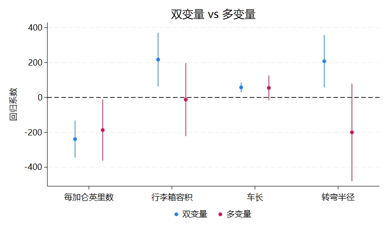

---

## 场景十：边际效应折线图

```stata
sysuse auto, clear

logit foreign mpg
margins, at(mpg=(10(2)40)) post
estimates store bi

logit foreign mpg turn price
margins, at(mpg=(10(2)40)) post
estimates store multi

coefplot bi multi, ytitle(Pr(foreign=1)) xtitle("每加仑英里数") ///
    at recast(line) lwidth(*2) ciopts(recast(rline) lpattern(dash)) ///
    title("预测边际效应") legend(position(6))
```

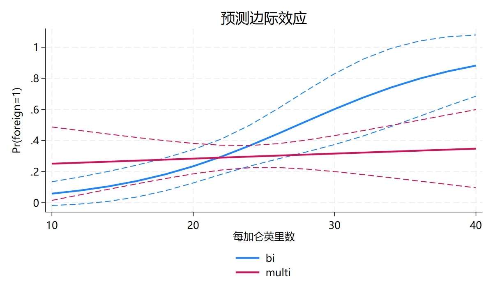

---

## 场景十一：显著性标注

### 11.1 按显著/不显著分开样式

```stata
sysuse auto, clear
regress price mpg trunk length turn

* 显著（CI 不含 0）用 pstyle(p2)，不显著用 pstyle(p3)
coefplot (., if(@ll>0 | @ul<0) pstyle(p2) label(显著)) ///
         (., if(@ll<0 & @ul>0) pstyle(p3) label(不显著)) ///
       , drop(_cons) nooffset xline(0) legend(on)
```

### 11.2 用星号标注 p 值

```stata
coefplot, vertical drop(_cons) yline(0) mlabposition(1) ///
    mlabel(cond(@pval<.001, "***", cond(@pval<.01, "**", ///
           cond(@pval<.05, "*", cond(@pval<.1, "+", ""))))) ///
    note("+ p<0.1, * p<0.05, ** p<0.01, *** p<0.001")
```

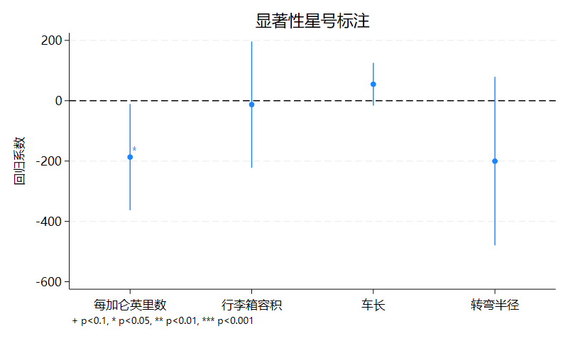

---

## 场景十二：矩阵绘图（中位数 + 置信区间）

```stata
sysuse auto, clear

* 手动计算中位数和 CI
matrix median = J(1, 3, .)
matrix colnames median = mpg trunk turn
matrix CI = J(2, 3, .)
matrix colnames CI = mpg trunk turn
matrix rownames CI = ll95 ul95

local i 0
foreach v of var mpg trunk turn {
    local ++i
    quietly centile `v'
    matrix median[1, `i'] = r(c_1)
    matrix CI[1, `i'] = r(lb_1) \ r(ub_1)
}

coefplot matrix(median), ci(CI) title("中位数及 95% 置信区间")
```

---

## 选项层级速查

coefplot 选项分为四层，上层选项作为下层默认值，下层可覆盖：

| 层级 | 使用位置 | 常用选项 |
|------|----------|----------|
| modelopts | `(model, opts)` | `keep()`, `rename()`, `eform`, `rescale()`, `transform()`, `asequation()` |
| plotopts | 系列/括号内 | `label()`, `msymbol()`, `recast()`, `offset()`, `noci`, `cionly` |
| subgropts | `\|\| plotlist, opts` | `bylabel()`, `title()` |
| globalopts | 最后逗号后 | `levels()`, `xline()`, `vertical`, `byopts()`, `sort()`, `coeflabels()` |

```stata
* 嵌套示例：全局 level(99 95)，但 model3 用 level(90) 覆盖
coefplot m1 m2 (m3, level(90)), drop(_cons) levels(99 95)
```

**关键位置规则**：
- `\|\| m2, opts2 opts3` → `opts2` 和 `opts3` 都是全局
- `\|\| m2, opts2 \|\|, opts3` → `opts2` 作用于 m2，`opts3` 是全局
- `(m1 \ m2, opts)` → `opts` 作用于两个模型
- `(m1 \ m2, opts \)` → `opts` 只作用于 m2

---

## 常见问题

**Q1：竖直布局后 xline(0) 没反应？**
> 竖直布局坐标轴翻转，参考线改为 `yline(0)`。

**Q2：多方程模型只显示了一个方程？**
> 用 `keep(*:)` 显示所有方程，如 `mlogit`、`tobit` 等。

**Q3：如何让两个模型系数重叠对比？**
> 用 `nooffsets` 关闭自动偏移，或用 `(m1 \ m2)` 合并到同一系列。

**Q4：如何给子图分别加参考线？**
> coefplot 不原生支持子图专属 `xline()`，用 `addplot 1:, xline(0) norescaling` 补充。

**Q5：系数名显示为变量名而非标签？**
> 用 `nolabels` 选项；查看原始系数名用 `regress, coeflegend`。

---

## 触发方式

本技能会在以下关键词出现时自动启用：
- `coefplot`、`系数图`、`回归系数图`
- `森林图`、`多模型对比`
- `bycoefs`、`子图`
- `margins 画图`、`Odds Ratio 图`

也可以显式触发：`/skill coefplot` 或 "用 coefplot 技能"。

---

## 参考

- 技能文件：`skills/coefplot/SKILL.md`
- 官方文档：https://repec.sowi.unibe.ch/stata/coefplot/getting-started.html
- Ben Jann (2014). "Plotting regression coefficients and other estimates." *The Stata Journal*, 14(4), 708-737.
